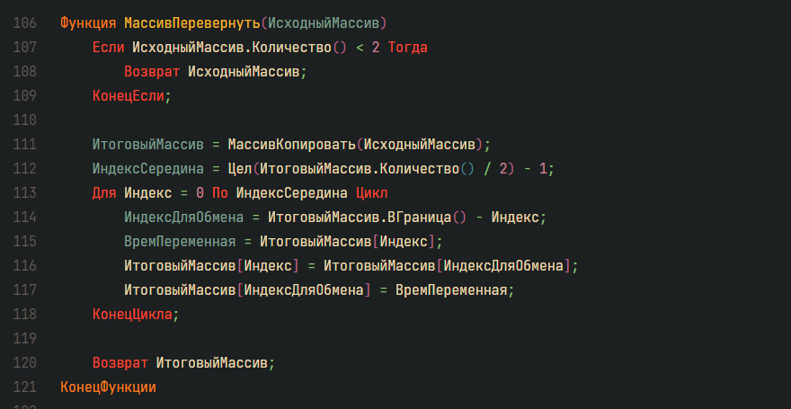

# Краткое описание

Основная цель проекта - расширить функционал по работе с коллекцией Массив на языке 1С и OneScript.

Не секрет, что в плане количества встроенных методов "из коробки" предпочтения разработчиков платформы были явно на стороне коллекции СписокЗначений, тогда как у объектов коллекции Массив доступно всего 9 встроенных методов. И по какой-то причине нет даже возможности создавать массивы на основе нескольких значений, как во многих других языках программирования, например:

```php
$number_array = [1, 4, -10, 20, 100]; // Создание массива в языке PHP.
```

И если начать решать стандартные алгоритмические задачки, то весьма быстро окажется, что встроенных методов 1C очень сильно не хватает. В итоге, было принято решение взять и самостоятельно написать часть недостающих функций для работы с массивами для использования в дальнейшем (к слову, это оказалось довольно интересно).

В таком подходе есть только два небольших недостатка: во-первых, это не методы встроенного класса Массив, а сторонние функции, которые вызываются *именно как функции*. В целом, это не сильно мешает, просто хотелось бы, конечно, иметь возможность дополнить встроенный класс или создать на его основе свой собственный. Во-вторых, функции написаны на встроенном языке программирования 1С (в отличие от стандартных методов), поэтому в плане производительности они, скорее всего, оставляют желать лучшего. Но для не слишком нагруженных прикладных задач и алгоритмов всё работает весьма неплохо.

## Какие новые функции были реализованы

* Функция <span style="color: #d31616">МассивВыбрать</span>(ИсходныйМассив) = возвращает один элемент, случайным образом выбранный из массива.

* Функция <span style="color: #d31616">МассивВыбратьНесколько</span>(ИсходныйМассив, КолЭлементов) = выбирает случайным образом уже несколько элементов. Возвращает массив с этими элементами.

* Функция <span style="color: #d31616">МассивКолВхождений</span>(Элемент, ИсходныйМассив) = возвращает количество вхождений указанного значения (элемента) в массив.

* Функция <span style="color: #d31616">МассивКопировать</span>(ИсходныйМассив) = возвращает независимую копию исходного массива.

* Функция <span style="color: #d31616">МассивКлонировать</span>(ИсходныйМассив) = тот же самый эффект, что и у предыдущей функции, но другой алгоритм реализации.

* Функция <span style="color: #d31616">МассивМаксЗначение</span>(ИсходныйМассив) = возвращает самое большое значение из массива на основе операции сравнения.

* Функция <span style="color: #d31616">МассивМинЗначение</span>(ИсходныйМассив) = возвращает самое маленькое значение из массива на основе операции сравнения.

* Функция <span style="color: #d31616">МассивНайтиЭлемент</span>(ИсходныйМассив, Элемент, ИндексСтартовый = -1) = функция ищет указанный элемент в массиве, начиная с указанного индекса. Возвращает индекс элемента, если он был найден, либо Неопределено, если ничего найдено не было, или переданный ИндексСтартовый выходит за границы массива.

* Функция <span style="color: #d31616">МассивПеревернуть</span>(ИсходныйМассив) = аналог классической функции array_reverse, возвращает массив "задом наперёд".

* Функция <span style="color: #d31616">МассивПеремешать</span>(ИсходныйМассив) = перемешивает все значения в массиве в случайном порядке, возвращает перемешанный массив (исходный массив остаётся прежним).

* Функция <span style="color: #d31616">МассивРасширить</span>(ИсходныйМассив, СтрокаЗначений) = попытка реализовать возможность добавления в массив сразу нескольких значений.
Все значения передаются в виде строки вида "Значение1,, Значение2,, Значение3", где ",, " является разделителем значений. Все переданные значения добавляются в массив в виде строк.
Также стоит отметить, что эта функция, в отличие от многих соседних, изменяет именно исходный массив.

* Функция <span style="color: #d31616">МассивСлучайныхЧисел</span>(Мин, Макс, Длина) = генерация массива случайных целых чисел. Значение параметра Мин также может быть и отрицательным.

* Функция <span style="color: #d31616">МассивСортировать</span>(ИсходныйМассив, Направление = "Возр") = сортирует значения в массиве по возрастанию (по умолчанию) или по убыванию (для этого надо во второй параметр передать значение "Убыв"). Если в функцию будет передано неверное значение для параметра Направление, то функция в любом случае отсортирует массив по возрастанию.
Примечание: функция возвращает новый отсортированный массив на основе исходного, исходный массив остаётся прежним.

* Функция <span style="color: #d31616">МассивСтрока</span>(ИсходныйМассив) = функция, преобразующая \**если это возможно*\* всё содержимое массива в строковое представление (например, для удобства дальнейшей печати через функцию Сообщить). Если преобразование по какой-то причине невозможно, будет вызвано исключение с сообщением об ошибке.

* Функция <span style="color: #d31616">МассивСтрокиВЧисла</span>(ИсходныйМассив, Строго = Истина) = преобразует \**если это возможно*\* все элементы исходного массива в элементы с типом Число, и формирует из них новый массив. Если это невозможно, то тут два варианта развития событий: либо вызов исключения (если параметр Строго = Истина), либо элемент добавляется в новый массив "как есть" (если Строго = Ложь). Функция возвращает новый массив, составленный по описанным выше условиям. Исходный массив остаётся прежним.

* Примечание: По идее, эта функция была разработана как парная к функции МассивРасширить, чтобы была возможность быстро преобразовать все строковые значения в числовые.

```1C
МассивА = Новый Массив;
МассивРасширить(МассивА, "10,, -30,, 20,, 50");
МассивА = МассивСтрокиВЧисла(МассивА);
```

* Функция <span style="color: #d31616">МассивУдалитьДубликаты</span>(ИсходныйМассив) = возвращает новый массив на базе исходного без повторяющихся элементов.

<br>

# Установка и запуск

Сначала необходимо [скачать архив](https://github.com/sudomango/1C-Extended-Arrays.git) или клонировать репозиторий с помощью системы Git.

Далее всё зависит от того, как вы собираетесь использовать эти функции. Есть три варианта:

* В виде отдельных автономных OneScript-файлов (лежат в [корне репозитория](https://github.com/sudomango/1C-Extended-Arrays)).

* Все функции в виде единого OneScript-файла с примерами использования (в каталоге [oscript_functions](https://github.com/sudomango/1C-Extended-Arrays/blob/main/oscript_functions)).

* А также в виде набора шаблонов текста для платформы "1С: Предприятие" (в каталоге [text_templates_1c](https://github.com/sudomango/1C-Extended-Arrays/blob/main/text_templates_1c)).

OneScript-файлы запускаются командой:

```shell
oscript имя_скрипта.os
```

Официальный репозиторий скриптового языка OneScript: [https://github.com/EvilBeaver/OneScript](https://github.com/EvilBeaver/OneScript).

Шаблоны текста можно добавить через Главное меню конфигуратора - Сервис - Шаблоны текста. В открывшейся панели выбираем кнопку Действие - Настройка шаблонов... (самый нижний пункт меню). В открывшемся окошке "Настройка шаблонов" нажимаем на кнопку "Добавить" (зелёный кружок с белым плюсом внутри). Указываем путь до файла МассивФункции.st, и нажимаем Открыть. После чего нажимаем кнопку ОК в "Настройке шаблонов". Приятного использования!

## Небольшое примечание

Если у вас нет желания скачивать репозиторий и устанавливать OneScript, результат работы файла с примерами был для удобства добавлен в виде текстового файла [console_ouput.txt](https://github.com/sudomango/1C-Extended-Arrays/blob/main/oscript_functions/console_ouput.txt).

